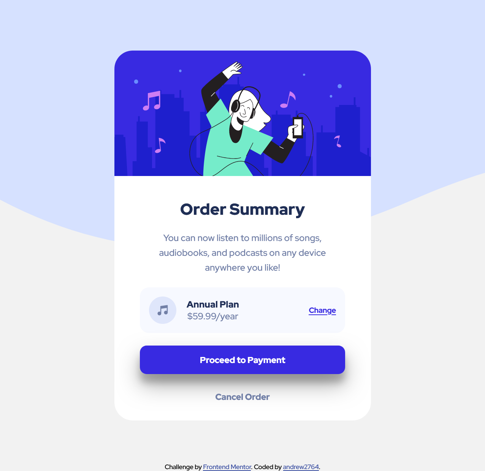
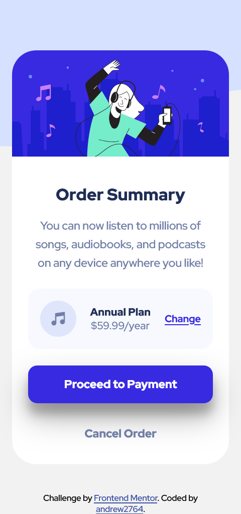

# Frontend Mentor - Order summary card solution

This is a solution to the [Order summary card challenge on Frontend Mentor](https://www.frontendmentor.io/challenges/order-summary-component-QlPmajDUj). Frontend Mentor challenges help you improve your coding skills by building realistic projects. 

## Table of contents

- [Frontend Mentor - Order summary card solution](#frontend-mentor---order-summary-card-solution)
  - [Table of contents](#table-of-contents)
  - [Overview](#overview)
    - [The challenge](#the-challenge)
    - [Screenshot](#screenshot)
    - [Links](#links)
  - [My process](#my-process)
    - [Built with](#built-with)
    - [What I learned](#what-i-learned)
    - [Useful resources](#useful-resources)
  - [Author](#author)

## Overview

### The challenge

Users should be able to:

- See hover states for interactive elements

### Screenshot




### Links

- Solution URL: https://www.frontendmentor.io/challenges/order-summary-component-QlPmajDUj/hub
- Live Site URL: https://andrew2764.github.io/order-summary-component/

## My process

### Built with

- Vanilla HTML/CSS
- Flexbox
- Mobile-first workflow
- BEM naming convention

### What I learned

First time in these challenges where I use background images.
I'm also not familiar with using the box-shadow CSS property. So much so that I simply went to https://getcssscan.com/css-box-shadow-examples and copied one of the examples into my code.

```css
.button--primary {
  box-shadow: rgba(0, 0, 0, 0.3) 0px 19px 38px,
    rgba(0, 0, 0, 0.22) 0px 15px 12px;
}
```
### Useful resources

As I mentioned earlier. I went to the following link to copy and paste a box-shadow example. I'll need to get myself fabiliar with wititng these up myself.
https://getcssscan.com/css-box-shadow-examples

## Author

- Frontend Mentor - [@andrew2764](https://www.frontendmentor.io/profile/andrew2764)
